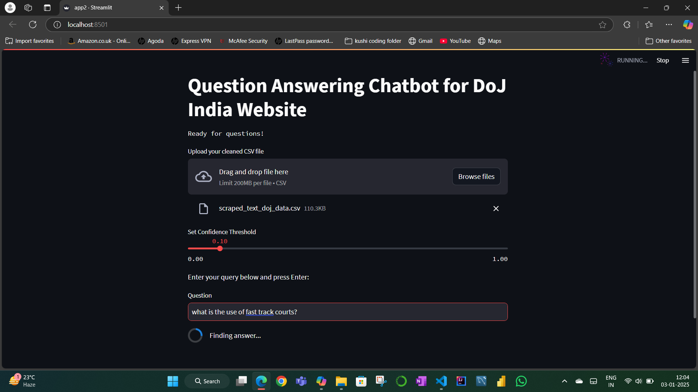
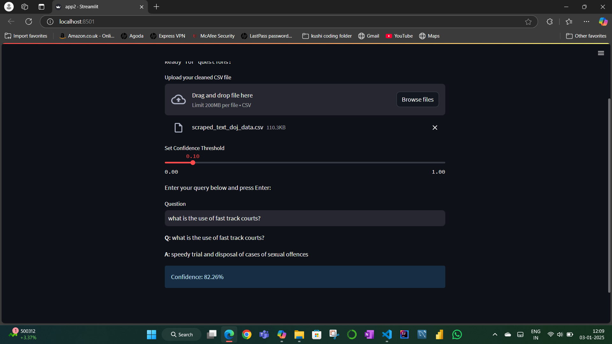

# 🏛️ DoJ Chatbot – Department of Justice India 🇮🇳

A question-answering chatbot built for the Indian Department of Justice (DoJ) using a transformer-based approach. The chatbot is designed to handle queries based on scraped DoJ website content and respond accurately using natural language processing.

> **Note:** This repository is for showcasing the concept and UI only. The backend code and data are not publicly available due to sensitivity and institutional policies.

---

## 📸 Screenshot Preview

---

## 💡 Features

- Responsive UI using Streamlit
- Upload your own CSV-based scraped data
- BERT-based transformer model for QA
- Handles long contexts using chunking logic
- Confidence scoring for answers

---

## 🔒 Why No Code or Data?

This project was developed as part of an academic submission and involves scraped content from a government website. To comply with privacy and institutional guidelines:

- Source code is stored locally.
- Scraped DoJ data is not shared.
- This GitHub repo is a **presentation-level mirror** only.

---

## 📃 License

This project is shared under the MIT License (for UI and design structure only). Backend logic is proprietary and not covered under this license.
